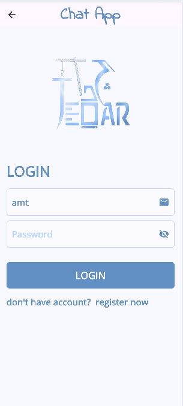

# 💬 Flutter Firebase Chat App

A real-time messaging application built with **Flutter** and powered by **Firebase**. This app features a complete authentication flow and instant messaging capabilities.

---

## ✨ Features

* **User Authentication:** Secure Sign Up and Login using Firebase Auth (Email/Password).
* **Real-time Chat:** Instant message delivery using Cloud Firestore streams.
* **Modern UI:** Clean and intuitive design with smooth animations.
* **Auto-scroll:** Automatically scrolls to the latest message when a new one arrives.
* **Secure:** Implements Firebase security rules to protect user data.

---

## 🚀 Tech Stack

* **Frontend:** [Flutter](https://flutter.dev/) (Dart)
* **Backend:** [Firebase](https://firebase.google.com/)
    * **Authentication:** For managing user accounts.
    * **Cloud Firestore:** To store and sync chat data in real-time.
* **State Management:** (e.g., Provider, Bloc, or GetX)

---

## 📸 Screenshots

| Authentication | Chat Interface |
| :---: | :---: |
|  |

---

## 📁 Project Structure

```text
lib/
├── models/         # Data models (e.g., Message, User)
├── screens/        # UI Screens (Login, Register, Chat)
├── services/       # Firebase logic & API calls
├── widgets/        # Reusable UI components
└── main.dart       # App entry point
```
---

## 🤝 Contributing
Contributions, issues, and feature requests are welcome! Feel free to check the issues page.

---

## 📜 License

This project is licensed under the MIT License.

---
## Made with ❤️ by Amr Khalifa
